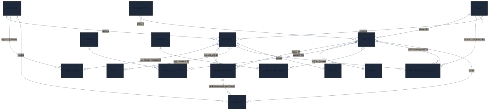
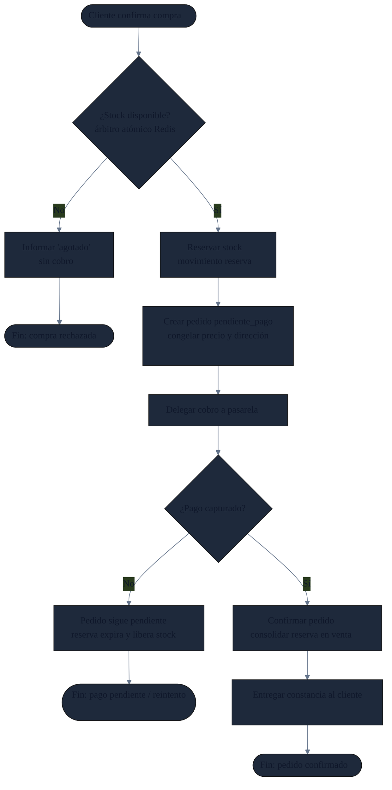
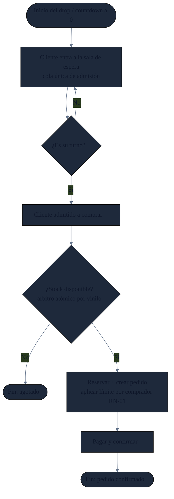

# ViveVinyls — Especificación funcional y modelo del sistema

**Proyecto:** Plataforma de comercio electrónico de vinilos
**Curso:** Infraestructura como Código
**Propósito del documento:** Especificación cerrada que sirve (a) como entregable de diseño y (b) como plano de construcción para el desarrollo asistido con Claude Code, evitando que el sistema se "invente".

---

## 1. Alcance y contexto

ViveVinyls es la plataforma de cara al cliente de una tienda de vinilos que proyecta expandirse en Sudamérica. El sistema digitaliza el ciclo de venta del lado del cliente —explorar el catálogo, seleccionar, pagar y configurar el envío— y, en el lado interno, la administración del catálogo y el inventario. El valor diferencial frente a vender en marketplaces generalistas es **ser dueños de la relación con el coleccionista**: sus datos, su historial y la experiencia de compra.

El negocio vende de dos formas predecibles: **venta normal** (demanda dispersa en el tiempo) y **drops** (lanzamientos anunciados con alta concurrencia simultánea). El sistema se diseña contemplando ambas, pero el MVP construye la venta normal; el drop es una extensión posterior.

### 1.1. Frontera del MVP

| En el MVP | Fuera del MVP (iteración posterior `[+]`) |
|---|---|
| Registro y autenticación de clientes | Drop con sala de espera y cola |
| Exploración, búsqueda y filtrado del catálogo | Back-office administrativo completo |
| Compra de venta normal (síncrona) con control de stock | Recomendaciones por comportamiento |
| Pago (integración simulada con pasarela tercerizada) | Reseñas y comunidad |
| Libreta de direcciones de envío | Seguimiento logístico / envíos |
| Inventario como ledger de movimientos | Reportes administrativos |

### 1.2. Stack tecnológico (fijado — no inventar)

| Capa | Tecnología |
|---|---|
| Estilo de arquitectura | Monolito modular (paquetes por dominio: `cuenta`, `catalogo`, `pedido`, `pago`, `inventario`) + worker desacoplado para drops `[+]` |
| Backend | Spring Boot (Java) |
| Persistencia | Spring Data JPA / Hibernate |
| Base de datos | PostgreSQL (Aurora en producción; Postgres local en desarrollo) |
| Árbitro de concurrencia / caché | Redis vía Spring Data Redis (ElastiCache en producción) |
| Cola de espera (drops) `[+]` | Amazon SQS vía Spring Cloud AWS / SDK + worker |
| Multimedia | Amazon S3 + CloudFront |
| Autenticación | Amazon Cognito (el backend valida el JWT como resource server) |
| Frontend | React + Vite (baja fidelidad, sin foco en estilos) |
| Build / empaquetado | Maven → JAR → Docker; aprovisionado por Terraform y configurado con Ansible |

---

## 2. Requisitos funcionales

Formato: `[actor] [acción de negocio] [objeto]`. Prioridad: **MVP** se construye ahora; **[+]** es iteración posterior.

### Módulo 1 — Cuentas
| ID | Requisito | Prioridad |
|---|---|---|
| RF-01 | El cliente se registra como miembro de la tienda | MVP |
| RF-02 | El cliente accede a su cuenta | MVP |
| RF-03 | El cliente administra sus datos y direcciones de envío | MVP |
| RF-04 | El cliente consulta su historial de compras | [+] |

### Módulo 2 — Catálogo
| ID | Requisito | Prioridad |
|---|---|---|
| RF-05 | El cliente explora el catálogo de vinilos | MVP |
| RF-06 | El cliente consulta la ficha completa de un vinilo | MVP |
| RF-07 | El cliente busca un vinilo por título o artista | MVP |
| RF-08 | El cliente filtra el catálogo por género, artista, año y sello | MVP |

### Módulo 3 — Selección de compra
| ID | Requisito | Prioridad |
|---|---|---|
| RF-09 | El cliente reúne vinilos para una compra | MVP |
| RF-10 | El cliente revisa su selección y el total a pagar | MVP |

> Nota: la selección (carrito) es **efímera**, vive en la sesión del cliente y no se modela como entidad persistente. Solo el pedido resultante persiste.

### Módulo 4 — Compra
| ID | Requisito | Prioridad |
|---|---|---|
| RF-11 | El cliente realiza la compra de los vinilos seleccionados | MVP |
| RF-12 | El cliente paga su pedido | MVP (pago simulado) |
| RF-13 | El cliente recibe constancia del resultado de su compra | MVP |

### Módulo 5 — Operación interna (staff)
| ID | Requisito | Prioridad |
|---|---|---|
| RF-14 | El equipo da de alta vinilos en el catálogo | [+] |
| RF-15 | El equipo edita los datos de los vinilos | [+] |
| RF-16 | El equipo registra el ingreso de inventario (importación) | [+] |
| RF-17 | El equipo promociona vinilos seleccionados | [+] |
| RF-18 | El equipo da seguimiento a los pedidos | [+] |

### Módulo 6 — Extensiones
| ID | Requisito | Prioridad |
|---|---|---|
| RF-19 | El cliente sigue el estado de su pedido hasta recibirlo | [+] |
| RF-20 | El cliente recibe sugerencias de vinilos afines a sus gustos | [+] |
| RF-21 | El cliente califica y reseña los vinilos que compró | [+] |
| RF-22 | El sistema gestiona ventas en modalidad drop con sala de espera | [+] |

---

## 3. Reglas de negocio

Las reglas **condicionan** a las funcionalidades; no son funcionalidades en sí.

| ID | Regla | Condiciona |
|---|---|---|
| RN-01 | En un drop, un comprador puede adquirir como máximo N unidades del mismo vinilo | RF-11, RF-22 |
| RN-02 | Un vinilo no puede venderse por encima de su stock disponible; el sistema previene la sobreventa | RF-11 |
| RN-03 | Solo un cliente que compró un vinilo (compra verificada) puede reseñarlo | RF-21 |
| RN-04 | La tienda nunca almacena datos de tarjeta; el cobro lo realiza un tercero y solo se guarda la referencia de la transacción | RF-12 |
| RN-05 | El stock se valida **antes** de cobrar: si no hay stock, la compra falla sin generar cobro | RF-11, RF-12 |
| RN-06 | El precio de un ítem se **congela** en el pedido al momento de la compra; cambios de precio posteriores no alteran pedidos existentes | RF-11 |
| RN-07 | La dirección de envío se **copia congelada** al pedido; editar la libreta no altera pedidos pasados | RF-03, RF-11 |

---

## 4. Requisitos no funcionales

Formato situado: cada RNF indica **qué**, en **qué situación**, sobre **qué alcance**, y **qué ocurre si falla**.

| ID | Requisito |
|---|---|
| RNF-01 | **Disponibilidad del flujo de compra.** Durante el horario comercial, los servicios de cara al cliente (catálogo, búsqueda, selección, compra) mantienen una disponibilidad mensual ≥99.9%, tolerando la caída de una zona de disponibilidad sin interrumpir las ventas. El back-office queda excluido de esta exigencia. |
| RNF-02 | **Disponibilidad reforzada en lanzamientos.** Durante los drops anunciados, el flujo de compra sostiene la concurrencia esperada; si los servicios secundarios no se sostienen, se degradan de forma controlada priorizando el checkout. |
| RNF-03 | **Protección de datos sensibles.** Las credenciales, referencias de pago e historial viajan cifrados (TLS 1.2+) y se almacenan cifrados (AES-256) en todo momento. |
| RNF-04 | **Elasticidad ante picos anticipados.** Para drops programados, la capacidad se dimensiona antes del evento (escalado anticipado); para picos no anunciados, el sistema escala reactivamente (>70% CPU) en ≤5 min. Si el escalado falla, la capacidad existente se mantiene y se alerta. |
| RNF-05 | **Absorción de concurrencia.** Durante los picos, las solicitudes de compra se serializan a nivel de inventario para resolver la disputa de stock sin sobreventa, ordenando la concurrencia antes de confirmar. |
| RNF-06 | **Resiliencia transaccional.** Para datos críticos (pedidos, inventario), la pérdida máxima ante falla es de 5 min (RPO ≤5 min); ante caída de la base principal, se promueve una réplica en <1 min. |
| RNF-07 | **Tiempo de respuesta.** En operación normal y de pico, el catálogo y la navegación responden en <2 s, apoyándose en una capa de caché que absorbe las lecturas frecuentes. |
| RNF-08 | **Entrega de multimedia.** Las portadas cargan en <1.5 s para toda la región, sirviéndose desde ubicaciones de borde (CDN) y no desde el origen central. |
| RNF-09 | **Disponibilidad diferenciada del back-office.** El panel interno (≈10 usuarios) no requiere alta disponibilidad ni escalado agresivo; su degradación temporal no afecta las ventas. Esta asimetría es deliberada. |

---

## 5. Modelo de entidades

Nivel conceptual con las decisiones de diseño ya tomadas: carrito efímero (fuera), stock como ledger de movimientos, dimensiones (artista/género/sello) como entidades, dirección con libreta + copia congelada, pago como entidad con ciclo de vida propio, y relaciones muchos-a-muchos resueltas con entidades puente.

### 5.1. Diccionario de entidades

| Entidad | Naturaleza | Propósito |
|---|---|---|
| CLIENTE | — | Persona registrada que compra. |
| DIRECCION | — | Libreta de direcciones del cliente (1 cliente → N direcciones). |
| VINILO | — | Producto vendible. Cada edición es un vinilo independiente (no se modelan variantes). Entidad bisagra del modelo. |
| ARTISTA | Dimensión | Catálogo de artistas; eje de búsqueda y campañas. |
| GENERO | Dimensión | Catálogo de géneros; eje de filtro. |
| SELLO | Dimensión | Sello editor (uno por vinilo). |
| VINILO_ARTISTA | Puente | Resuelve la relación N:M vinilo–artista (compilaciones, colaboraciones). |
| VINILO_GENERO | Puente | Resuelve la relación N:M vinilo–género. |
| PEDIDO | Hecho | Compra concreta. Estados: `pendiente_pago → pagado → confirmado → cancelado`. Guarda copia congelada de la dirección. |
| ITEM_PEDIDO | Hecho | Línea del pedido; congela cantidad y precio unitario al momento de la compra. |
| PAGO | Hecho | Intento(s) de pago de un pedido. Estados: `pendiente → autorizado → capturado → fallido → reembolsado`. Guarda la referencia del tercero, nunca datos de tarjeta. |
| MOVIMIENTO_STOCK | Hecho (ledger) | Registro append-only del inventario. Tipos: `importación (+)`, `reserva (− temporal)`, `confirmación`, `cancelación (+)`. El stock es un cálculo, no un atributo. |
| PROMOCION | — | Descuento/campaña con vigencia (fecha inicio/fin); puede aplicar a vinilos (y, a futuro, a dimensiones). |
| STAFF `[+]` | — | Usuario interno; relación de trazabilidad (quién hizo qué). |
| RESENA `[+]` | Hecho | Calificación de un vinilo; habilitada solo por compra verificada (RN-03). |
| ENVIO `[+]` | Hecho | Logística del pedido; integración con courier tercerizado. |

> **Stock — modelo de tres estados:** *Físico* = suma del ledger; *Reservado* = comprometido por pedidos activos; *Disponible* = Físico − Reservado. El **Disponible** es el número que ve el cliente y el que decide la venta. La concurrencia sobre el Disponible se serializa con un contador atómico en Redis; el ledger en Postgres es la verdad histórica auditable.

---

## 6. Casos de uso

### CU-01 — Registrarse y verificar cuenta
- **Actor:** Cliente
- **Precondición:** El cliente no tiene cuenta.
- **Flujo principal:** (1) El cliente envía sus datos de registro. (2) El sistema crea la cuenta en estado no verificado. (3) El sistema envía un código/enlace de verificación. (4) El cliente verifica. (5) La cuenta queda activa.
- **Flujo alternativo:** 1a. El correo ya está registrado → el sistema lo informa y ofrece iniciar sesión.
- **Postcondición:** Cliente con cuenta verificada y activa.

### CU-02 — Explorar y filtrar el catálogo
- **Actor:** Cliente (incluye visitante no autenticado)
- **Precondición:** Existe catálogo publicado.
- **Flujo principal:** (1) El cliente abre el catálogo. (2) Aplica búsqueda por título/artista y/o filtros (género, artista, año, sello). (3) El sistema devuelve los vinilos coincidentes con su stock disponible. (4) El cliente abre la ficha de un vinilo.
- **Reglas:** El stock mostrado es el *disponible* (puede tener latencia respecto al instante de compra).
- **Postcondición:** El cliente visualiza vinilos y puede seleccionarlos.

### CU-03 — Realizar compra (venta normal) **[caso central del MVP]**
- **Actor:** Cliente autenticado
- **Precondición:** El cliente tiene al menos un vinilo seleccionado y una dirección registrada.
- **Flujo principal:**
  1. El cliente confirma la compra (checkout).
  2. El sistema, **antes de cobrar**, intenta reservar el stock de cada ítem mediante el árbitro atómico (Redis): decrementa el disponible si hay unidad.
  3. Si todos los ítems tienen stock, el sistema crea el PEDIDO en estado `pendiente_pago`, congela precios (RN-06) y copia la dirección (RN-07), y registra los movimientos de **reserva** en el ledger.
  4. El cliente paga (CU-04).
  5. Con el pago capturado, el pedido pasa a `confirmado` y las reservas se consolidan en venta.
  6. El sistema entrega constancia del resultado al cliente.
- **Flujos alternativos:**
  - 2a. **Sin stock** (otro comprador tomó la última unidad): el árbitro rechaza la reserva → el sistema informa "agotado" **sin generar cobro** (RN-05) y actualiza el disponible en la vista.
  - 4a. **Pago falla:** el pedido permanece `pendiente_pago`; las reservas expiran tras un tiempo límite y el stock vuelve a estar disponible (movimiento de cancelación).
- **Reglas asociadas:** RN-02, RN-05, RN-06, RN-07.
- **Postcondición:** Pedido `confirmado` con stock consolidado, o compra rechazada sin cobro.

### CU-04 — Pagar pedido
- **Actor:** Cliente autenticado
- **Precondición:** Existe un pedido en `pendiente_pago` con stock reservado.
- **Flujo principal:** (1) El cliente inicia el pago. (2) El sistema delega el cobro a la pasarela tercerizada. (3) La pasarela responde el resultado. (4) El sistema registra el PAGO con su referencia y estado (RN-04). (5) Si el pago se captura, el pedido se confirma.
- **Flujo alternativo:** 3a. Pago rechazado → PAGO en `fallido`; el cliente puede reintentar (nuevo intento de pago sobre el mismo pedido).
- **Postcondición:** Pago registrado; pedido confirmado o pendiente de reintento.

### CU-05 — Administrar vinilo (staff) `[+]`
- **Actor:** Staff
- **Precondición:** Staff autenticado.
- **Flujo principal:** (1) El staff da de alta o edita un vinilo y sus relaciones (artistas, géneros, sello). (2) Registra el ingreso de inventario como movimiento de **importación (+)**. (3) El sistema deja rastro de quién realizó el cambio (trazabilidad).
- **Postcondición:** Catálogo y/o inventario actualizados con trazabilidad.

---

## 7. Diagramas de flujo

### 7.1. Compra en venta normal (síncrona) — MVP

### 7.2. Compra en modalidad drop (con sala de espera) — `[+]`

> La **sala de espera** gestiona la *admisión* (cuánta gente entra a la vez) y es infraestructura efímera del evento; el **árbitro de stock** —uno por vinilo— gestiona la *disputa de inventario*. Son responsabilidades separadas: el escalado elástico de la infraestructura da capacidad; la cola da orden a la concurrencia.

---

## 8. Contrato de API preliminar (derivado de los casos de uso)

Superficie mínima del MVP. Es preliminar: se afina al diseñar la UI.

| Método | Endpoint | Caso de uso | Notas |
|---|---|---|---|
| POST | `/auth/registro` | CU-01 | Crea cuenta no verificada |
| POST | `/auth/verificar` | CU-01 | Activa la cuenta |
| POST | `/auth/login` | RF-02 | Devuelve token de sesión |
| GET | `/vinilos` | CU-02 | Soporta búsqueda y filtros (query params) + paginación |
| GET | `/vinilos/{id}` | CU-02 | Ficha completa |
| GET | `/clientes/me/direcciones` | RF-03 | Libreta del cliente |
| POST | `/clientes/me/direcciones` | RF-03 | Alta de dirección |
| POST | `/pedidos` | CU-03 | Checkout: reserva stock y crea pedido |
| POST | `/pedidos/{id}/pago` | CU-04 | Inicia el pago del pedido |
| GET | `/pedidos/{id}` | RF-13 | Estado y resultado de la compra |

---

## 9. Definición de "terminado" del MVP

El MVP se considera completo cuando un cliente puede, de extremo a extremo:

1. Registrarse y verificar su cuenta, e iniciar sesión.
2. Explorar el catálogo con búsqueda y filtros, viendo el stock disponible.
3. Seleccionar vinilos y revisar el total.
4. Confirmar la compra con **validación de stock antes del cobro** (sin sobreventa, sin cobrar si no hay stock).
5. Pagar (pasarela simulada) y recibir la constancia del resultado.

Con el inventario operando como **ledger de movimientos** y la concurrencia resuelta por el **árbitro atómico** (incluso si la cola de drops aún no existe). Todo empaquetado en Docker, desplegable sobre la infraestructura Terraform ya definida.

---

## 10. Prácticas de desarrollo

Se adoptan prácticas de Extreme Programming adaptadas a un desarrollo individual asistido por IA —notablemente **TDD** (test primero, con JUnit, en la lógica de negocio crítica: cálculo de total, prevención de sobreventa, transición de estados del pedido) e **historias de usuario** derivadas de los requisitos funcionales—. No se aplica XP como metodología de equipo (pair programming, propiedad colectiva), por ser un desarrollo individual. El TDD se aplica de forma selectiva sobre la lógica que de verdad importa, no sobre operaciones triviales.
